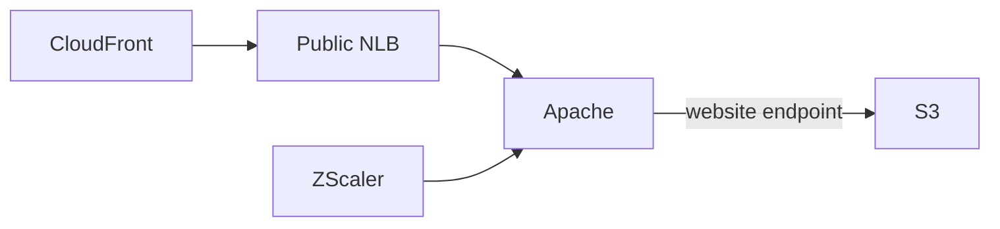
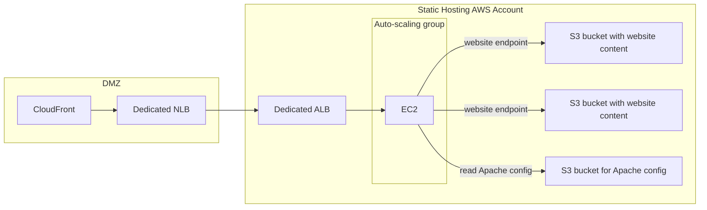
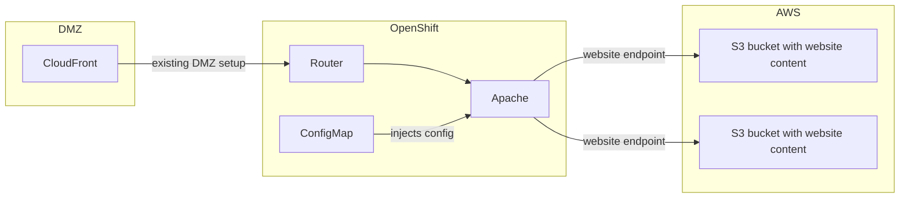

# architecture-poc-openshift-apache-s3-proxy

## Context

Sanofi serves hundreds of public websites from S3.
The initial basic setup was:


Unfortunately:
- It made all website public, including dev/test versions
- It didn't offer all the required business capabilities, such as lowercasing URLs, supporting URL redirects, supporting nested single-page-apps...

For this reason, the current design is:



This:
- allows to have private websites easily
- enables the benefits from AWS S3 Website endpoints, such as URL redirects
- enables the power of Apache for advanced features (lowercasing, etc)

## POC purpose

Because the websites are cached in CloudFront, Apache has a very small footprint.
However it still runs on EC2 auto-scaling instances.



This POC shows how we can migrate the Apache cluster to OpenShift.



## POC Design

- [s3-infra](openshift): infrastructure setup for the S3 bucket
- [s3-content](s3-content): sample content for the S3 bucket
- [openshift](openshift): openshift deployment for Apache

## Deployment

Once deployed, the route will be similar to
https://apache-apache.apps.scale-3aaba2fb.p560298742787.aws-apac.sanofi.com

Many domain names can point to this route.
Apache will proxy to the corresponding bucket, according to the rules in [openshift/apache.conf](openshift/apache.conf).

## Notes about VPC Endpoints

The S3 bucket must allow traffic from the S3 VPC endpoint where Apache is deployed.
In a producvtion context, this would be the S3 VPC Endpoint **in the OpenShift AWS account**.

However:
- During the POC we couldn't manage to pick up the S3 VPC Endpoint
- The OpenShift sandbox is in APAC, which still uses Squid (APAC has not been migrated to Zscaler yet)

This means we used the Squid proxies for the POC.
The endpoint configured for the POC is the S3 VPC Endpoint in APAC Shared Services (where Squid is deployed).

## Reloading the config

If the `ConfigMap` is changed, it should reflect inside the containers after a few seconds.
However Apache will not take it into account. There are 2 options available:

- Start a new `Deployment` rollout, which will create fresh containers. These containers will apply the new config when they start.
- Run the following command in all running containers: `/opt/rh/httpd24/root/usr/sbin/httpd -k graceful`. This will stop all child processes after their current request and reload the config.
  
For example, from a CI/CD pipeline:

```bash
names=$(oc get pods --selector app=apache --output json | jq -r '.items[].metadata.name')
while IFS= read -r name; do
  echo "Reloading config for pod $name"
  oc exec -i $name -- /bin/bash -s <<< "httpd -k graceful"
done< <(echo $names)
```
